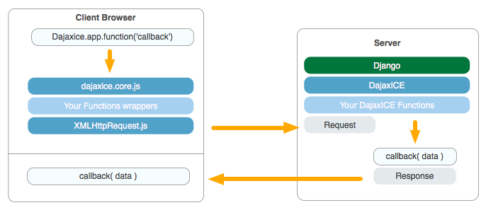

.. django-dajaxice documentation master file, created by
   sphinx-quickstart on Wed Nov  3 14:58:47 2010.
   You can adapt this file completely to your liking, but it should at least
   contain the root `toctree` directive.

Welcome to dajaxice!
===========================================
Dajaxice is the *communication core* of dajaxproject. Its main goal is to trivialize the asynchronous communication within the django server side code and your js code.

django-dajaxice is a **JS-framework agnostic** library and focuses on decoupling the presentation logic from the server-side logic. dajaxice only requieres **5 minutes to start working.**

Dajaxice has the following aims:

* Isolate the communication between the client and the server.
* JS Framework agnostic (No Prototype, JQuery... needed ).
* Presentation logic outside the views (No presentation code inside ajax functions).
* Lightweight.
* Crossbrowsing ready.
* `Unobtrusive standard-compliant (W3C) XMLHttpRequest 1.0 <http://code.google.com/p/xmlhttprequest/>`_ object usage.

Why should I use dajaxice?
--------------------------
* Cleaner code. Your ajax functions works uniform.
* All your presentation logic resides in JS.
* dajaxice didn’t require any JS Framework.

Gettting Started
--------------------
If you’re new to dajaxice, you may want to start with these documents:

.. toctree::
   :maxdepth: 2

   installation
   create-my-first-dajaxice-function
   custom-error-callbacks
   production-environment
   migrating-to-02
   csrftoken-issues
   available-settings
   modules.rst

How does it works
==================

Indices and tables
==================

* :ref:`genindex`
* :ref:`modindex`
* :ref:`search`

Requirements
--------------------------
Dajaxice doesn't require any special package to start working.

* Python>=2.4
* Django>=1.1.4

